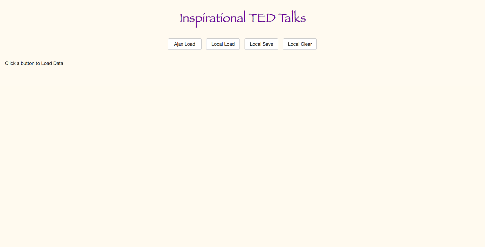
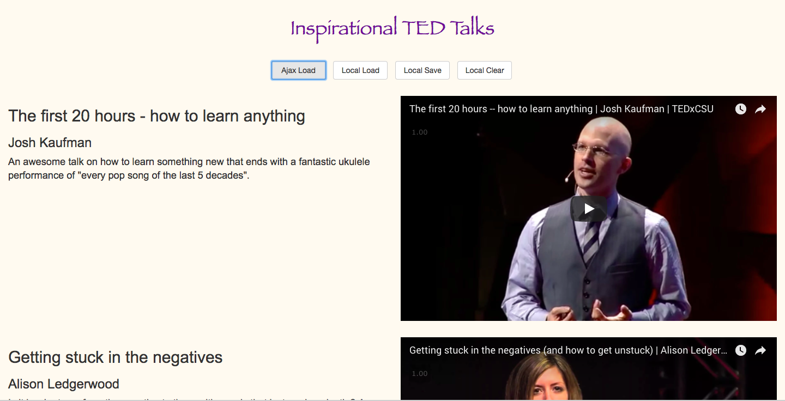
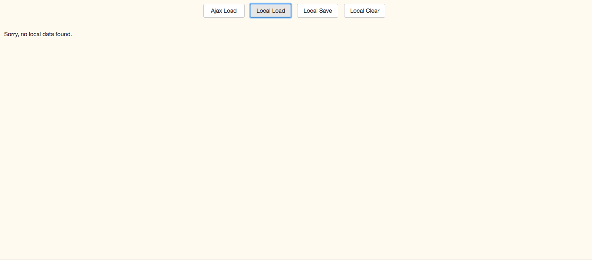

# I am AJAX-ed

## Release0 : Create the Web Page

1) Create a basic webpage with the title "Inspirational TED Talks". The page should be blank and have the Title on the top as an `h1`
2) Create four button with titles
    - Ajax Load
    - Local Load
    - Local Save
    - Local Clear

The page should look something like this: 

## Release1 : Make the button `Ajax Load` work

1) On clicking the button `Ajax Load`, you need to send a request to [this](https://soal-assessment.herokuapp.com/tedTalks.php) page and get 3 random results from the JSON file. 
2) You need to display the results from the JSON as follows: 
    - Title of the Talk on the left
    - Name of the Speaker below the Title
    - Description of the Speaker below the Name
    - Embedded Youtube video on the right

3) Post the request, the page should look something like this: 

## Release2 : Store it
Now implement the functionality of the other 3 buttons as follows: 

1) Clicking `Local Save` saves the AJAX results in your HTML local storage

2) Clicking `Local Load` shows the JSON results that are saved in local storage & just display them like the image above. This should show an error that says "Sorry, no local data found" if the `Local Save` method isn't executed.
It should look something like this: 

3) Clicking `Local Clear` clears away your local storage. If you click on `Local Load` now, it should show you the empty webpage

